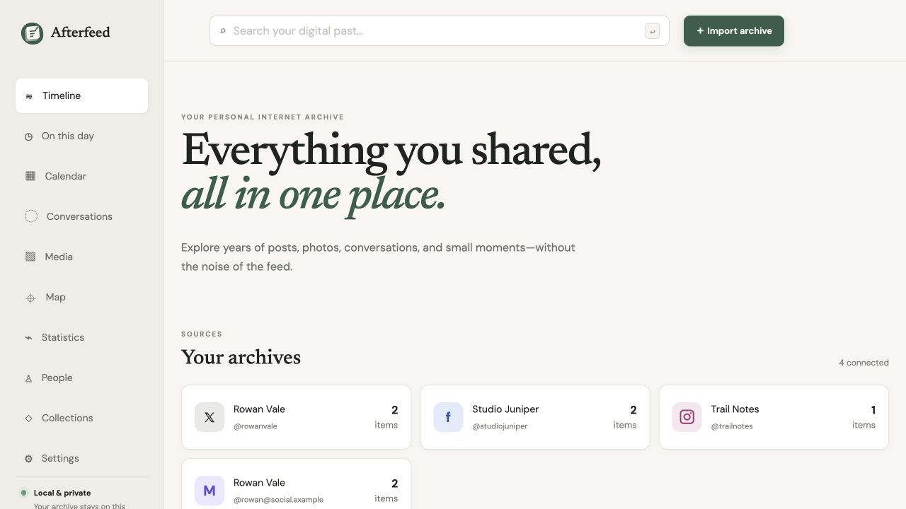
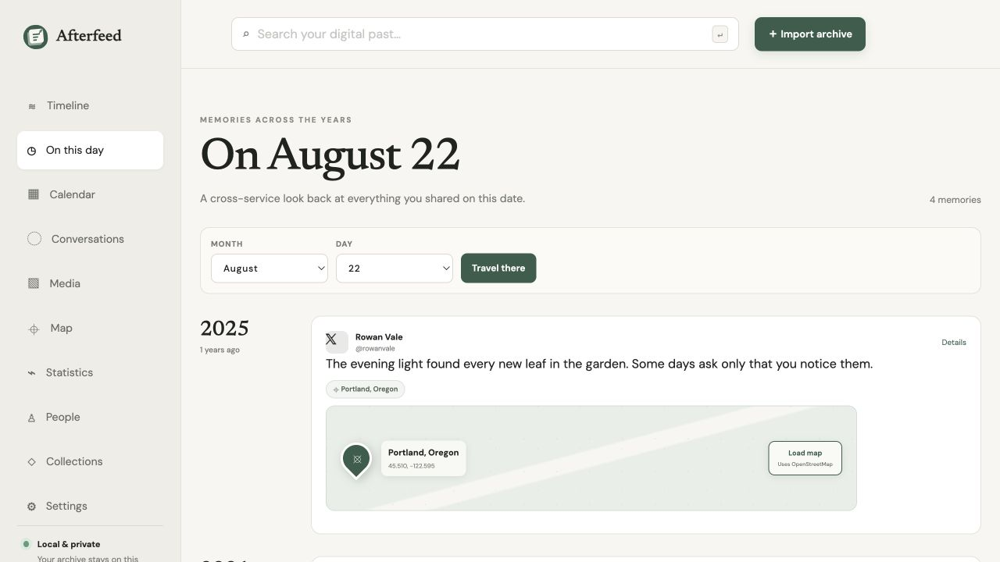
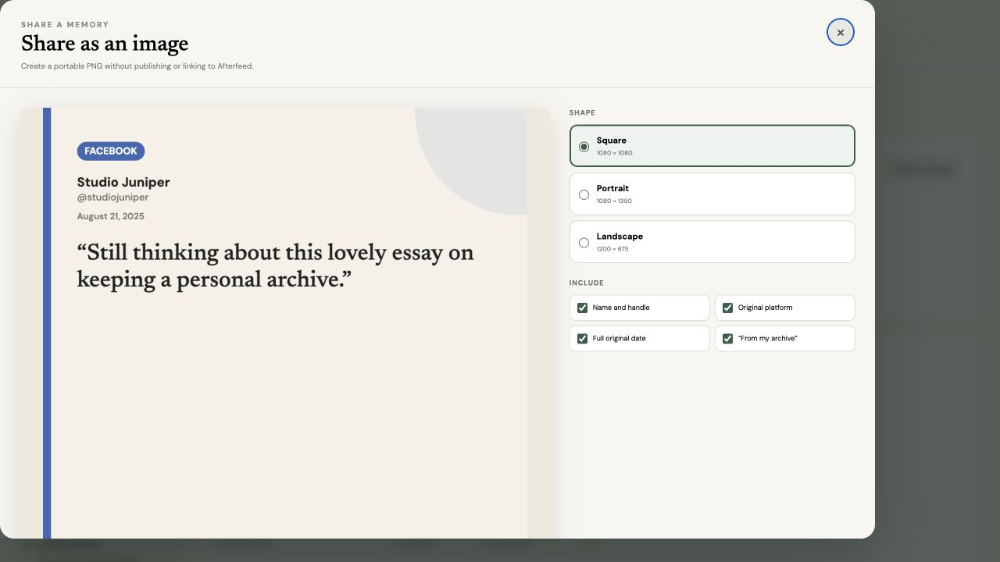

# Afterfeed product tour

Afterfeed brings personal social exports into one quiet, private interface. Sign-in and per-user ownership isolate each library on shared installations. The screenshots below were captured from a temporary database containing only fictional accounts, invented posts, synthetic links, and non-personal locations. No real archive content or identifying information appears in these images.

## One timeline for every archive

The home screen keeps imported identities visible without forcing every service into a separate silo. Search, account filters, dates, post types, and media filters narrow the unified timeline.

Afterfeed currently recognizes Twitter/X, Mastodon, Facebook, Reddit, Instagram, Google+, Nextdoor, LiveJournal, and Jekyll archives. Google+ Takeout support brings posts, authored and embedded comments, +1s, shared links, check-ins, and post media into the same timeline. Nextdoor content reports add neighborhood posts, comments, reactions, messages, and listings while filtering sensitive account fields. Jekyll source archives add published articles, front matter, tags, permalinks, and referenced local media; see the [import guide](importing.md) for format details.

## Rediscover a date across services

On This Day groups memories by year regardless of where they were originally posted. Location-bearing cards include a local preview; detailed OpenStreetMap tiles load only when requested.

## Share a memory without sharing Afterfeed

Any post can become a square, portrait, or landscape PNG. The card is rendered locally in the browser, has no Afterfeed URL, and lets the user remove identity, platform, date, footer, or media before downloading or copying it.

## Explore further

Afterfeed also includes reconstructed conversations, a media gallery, yearly activity calendars, statistics, people and relationship views, collections, privacy-aware exports, a read-only API, and local or authenticated remote MCP access. Archive-specific preservation details live in the [import guide](importing.md).
